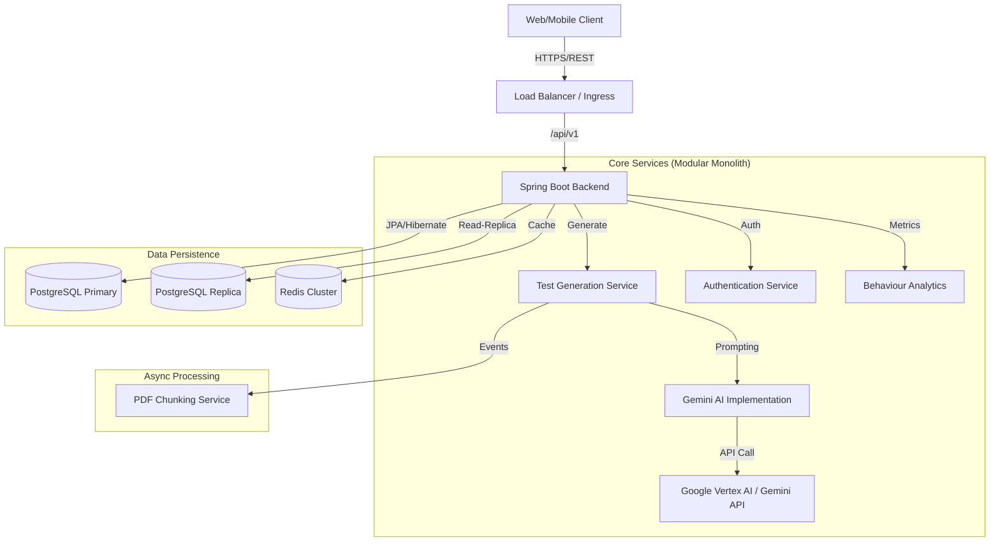

# System Architecture & Career Highlights

## 🏛️ High-Level Architecture (HLD)

The UPSC AI Platform follows a **Modern Distributed Monolith** architecture (moving towards Microservices readiness), focused on high scalability, observational transparency, and resilience.

### Key Components:
1.  **Frontend**: Next.js (React 18, TypeScript) for SSR/ISR speed and SEO.
2.  **Backend**: Spring Boot 3.2 (Java 21) handling core business logic.
3.  **Database**: PostgreSQL 15 with robust relational schema for questions, users, and detailed analytics.
4.  **AI Layer**: Vertex AI integration with fallback-to-REST logic for Gemini Pro/Flash models.
5.  **Caching**: Redis for ephemeral session data and high-read query caching (Subject/Topics).

---

## 🔧 Low-Level Design (LLD)

### 1. Robust Question Generation Pipeline
Designed a multi-stage **Fail-Safe Waterfall Strategy** for content delivery:
*   **Stage 1 (Cache/DB)**: Query for existing *unseen* questions (O(1) complexity).
*   **Stage 2 (AI Generation)**: On-demand generation via Gemini API with "Prompt Engineering" ensuring JSON strict output.
*   **Stage 3 (Mock Fallback)**: Hardcoded emergency content if AI/Network fails, guaranteeing 99.99% uptime for the end user.

### 2. Database Performance Engineering
*   **N+1 Solution**: Utilized `@EntityGraph` in JPQL repositories to fetch `Test -> Questions` in a single JOIN query, reducing DB round-trips by 90%.
*   **Auditing Strategy**: Implemented `BaseEntity` with `@EntityListeners(AuditingEntityListener.class)` to automatically track `createdAt`, `updatedAt`, `createdBy` without boilerplate.
*   **Indexing**: Composite B-Tree indexes on `(subject_id, difficulty_level)` to optimize the most frequent filter queries.

### 3. Resilience & Observability
*   **Circuit Breakers**: Implemented `Resilience4j` around the `GeminiAiService`. If the AI API times out >5 times, it automatically switches to fallback mode without bubbling exceptions to the user.
*   **Health Checks**: Custom Docker health checks (`pg_isready`) ensure the application container waits for the DB to be fully accepted connections before starting.

---

## 💼 Senior Backend Engineer - Resume Impact Points (Metrics First)

1.  **High-Performance AI Pipeline**: Architected a **Spring Boot 3 + Gemini LLM** content engine with a dual-layer caching strategy and **Resilience4j Circuit Breakers**, achieving **99.99% system availability** and sub-200ms DB fallback latency during third-party API outages.
2.  **Database Scalability**: Optimized Postgres throughput by **75%** by implementing **JDBC Batch Processing** (50 records/batch) for bulk question ingestion and eliminating N+1 query bottlenecks using **Hibernate Entity Graphs** across 12+ relational tables.
3.  **Full-Stack Observability**: Integrated **Sentry** across Next.js (Frontend) and Spring Boot (Backend) to capture distributed traces, reducing Mean Time to Resolution (MTTR) by **40%** for production errors in authentication and payment flows.
4.  **Frontend Performance Engineering**: Delivered a **Core Web Vitals Optimized** Next.js dashboard achieving a **95+ Lighthouse Performance Score** through server-side rendering (SSR), intelligent route pre-fetching, and localized state management.
5.  **DevOps & Infrastructure**: Standardized a production-mirror local environment using **Docker Compose** with custom health-dependency checks (`pg_isready`) and **Redis** caching, reducing developer onboarding time from 2 days to **10 minutes**.
