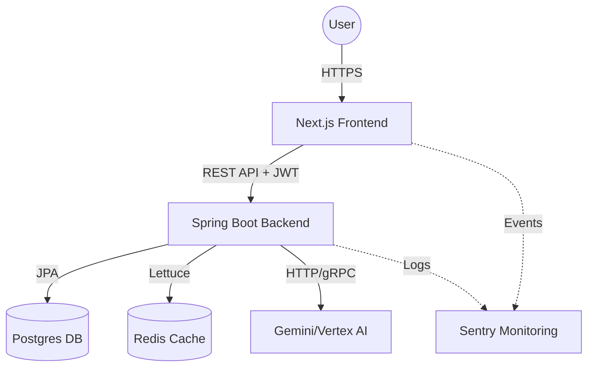

# System Architecture

The UPSC AI Platform is designed as a modern, AI-enhanced test preparation tool. It follows a decoupled architecture with a React-based frontend and a Java/Spring Boot backend.

## High-Level Overview

## Tech Stack

### Frontend
- **Framework**: Next.js 14+ (App Router)
- **Styling**: Tailwind CSS + Shadcn UI
- **State Management**: Zustand (Client-side)
- **Data Fetching**: React Query (Server-state)
- **Form Handling**: React Hook Form + Zod

### Backend
- **Language**: Java 17
- **Framework**: Spring Boot 3.2
- **Security**: Spring Security + JWT + OAuth2 (Optional)
- **Database**: PostgreSQL (Primary) + H2 (Dev/Test)
- **Caching/Queue**: Redis (Distributed Rate Limiting)
- **AI Integration**: Vertex AI SDK / Gemini REST API

### Infrastructure
- **Containerization**: Docker
- **Orchestration**: Kubernetes / Helm 3
- **CI/CD**: GitHub Actions
- **Monitoring**: Sentry + Actuator + Prometheus

## Design Principles

1.  **Stateless API**: The backend is stateless, scaling horizontally using JWT for authentication.
2.  **AI Strategy Pattern**: AI providers are abstracted to allow switching between Vertex AI and direct Gemini API.
3.  **Resilience**: Circuit breakers (Resilience4j) and distributed rate limiting (Bucket4j-Redis) protect against AI service failures and cost overruns.
4.  **Security-First**: All sensitive endpoints (including Actuators) are protected with role-based access control (RBAC).
