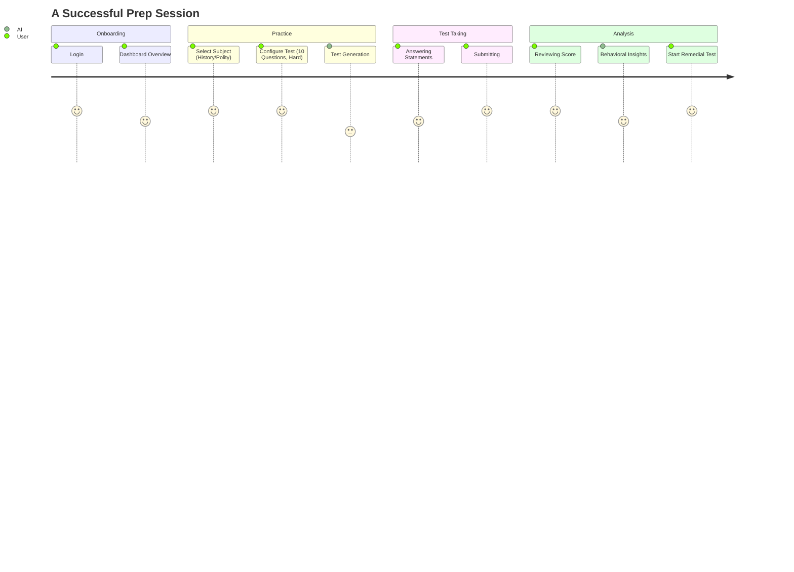

# User Journey & Key Features

This document maps the core user experience and the intelligent features of the UPSC AI Platform.

## Core Flow (The UPSC Prep Cycle)

## Key Feature Breakdown

### 1. Intelligent Test Generation
The system doesn't just pull from a pool; it uses a "Persona-Matched" generation strategy. It ensures that "HARD" questions mimic the exact multi-statement analytical style used in recent UPSC Prelims papers.

### 2. Behavioral Diagnostics
Post-test, the AI analyzes more than just the "Correct/Incorrect" status. It looks at:
- **Mistake Type**: Was it a Silly Mistake (fast response on easy Q) or a Knowledge Gap?
- **Fatigue Tracking**: Performance degradation over time during the session.

### 3. Dynamic Remedial Loops
Users can instantly generate a "Remedial Test" specifically targeting the sub-topics they just failed, closing the learning loop immediately.

### 4. Library & PDF Interactions
Users can upload PDFs of standard textbooks (e.g., Laxmikanth, Spectrum). The AI then:
1.  **Extracts Questions**: Automatically finds questions within the text.
2.  **Context-Aware Practice**: Generates new tests *using only the facts found in that specific PDF*.
